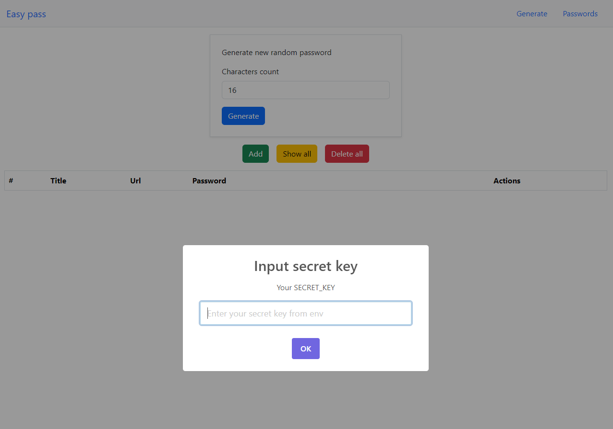

# Easy pass

Easy pass is self-hosting app for password managment.
There are many great inspirations [vaultwarden](https://www.vaultwarden.net/), [passbolt](https://www.passbolt.com/), [bitwarden](https://bitwarden.com/), and others, but I struggled to self-host them myself due to the complexity of configuring HTTPS. 😂 Because of that, I created **Easy Pass**. The idea is simple: to have a self-hosted password manager without the need for HTTPS configuration, reverse proxies, or similar setups.

> [!TIP]
> I suggest learning how to set up HTTPS because it's more secure than just using HTTP.

## How does it works?

The client-side sends a request to the server, which will generate a random password. The server will encrypt it using the `aes-256-cbc` algorithm, with `SECRET_PHRASE` and `SECRET_IV` being used for encryption.

> [!IMPORTANT]
> For security reasons, each request from the client needs an `X-Secret` header. This should match the `SECRET_KEY` value; otherwise, it will not work.

## Dependencies

Unfortunately, I can't build everything from scratch, so here are all the dependencies:

- Client side:
  - [Boostrap CSS](https://getbootstrap.com/)
  - [SweetAlert2](https://sweetalert2.github.io/)
- Server side:
  - [Express js](https://expressjs.com/)
  - [Mongoose](https://mongoosejs.com/)
  - [dotenv](https://www.npmjs.com/package/dotenv)
  - [nodemon](https://www.npmjs.com/package/nodemon) - Not used in code but usefull for developing.

All dependencies are required to be installed only once on the server side. After that, you can use it without the internet. On the client side, SweetAlert2 is included with minified code, but Bootstrap CSS is not. If you go offline on the client side, it will still work, but you'll miss some styles from Bootstrap. 😢

In the future, I will update the client-side code to have **zero** dependencies and a better UI/UX.

## Environment variables

| name          | description                                                                                                   | type     | example                                | default |
| ------------- | ------------------------------------------------------------------------------------------------------------- | -------- | -------------------------------------- | ------- |
| PORT          | Server port                                                                                                   | `number` | `3000`                                 | `3000`  |
| DATABASE_URL  | URL for database connection                                                                                   | `string` | `mongodb://localhost:27017/easy-pass`  | nothing |
| SILENT_LEVEL  | Value for showing console outputs                                                                             | `number` | `0`                                    | `0`     |
| SECRET_KEY    | Secret key which should be matched for each request                                                           | `string` | Something strong, 5-30 char            | nothing |
| SECRET_PHRASE | Secret phrase which will be used for encrypt/decrypt                                                          | `string` | Something strong, exactly 32 character | nothing |
| SECRET_IV     | Secret [IV](https://csrc.nist.gov/glossary/term/initialization_vector) which will be used for encrypt/decrypt | `string` | Something strong, exactly 16 character | nothing |

> [!TIP]
> For secrets, you can use Node.js's built-in `crypto` function: `crypto.randomBytes(16).toString('base64')`.

### Example env

```
PORT = 3000
DATABASE_URL = mongodb://localhost:27017/easy-pass
SILENT_LEVEL = 2
SECRET_IV = q10wA5fbm1WLdK2984PoJA==
SECRET_KEY = VZCnhOUGozJJGOGRyr5kDw==
SECRET_PHRASE = PsKA53DqytgX6nlGDuEK8zqjlnZP/nurfBm7tnsXg3s=
```

## Silent level

The silent level is used to control the display of `console` outputs. Some logs are forced to be visible to understand the exact reason why the application stopped.

| level | description                |
| ----- | -------------------------- |
| `0`   | Nothing will be logged     |
| `1`   | Only errors will be logged |
| `2`   | Everything will be logged  |

## How to setup

You have to install [docker](https://www.docker.com/) and [docker compose](https://docs.docker.com/compose/).

After that run this scripts:

```
mkdir easy-pass
cd easy-pass
docker pull kostad02/easy-pass:latest
curl -o docker-compose.yml https://raw.githubusercontent.com/KostaD02/easy-pass/main/server/docker-compose.yml
```

> [!CAUTION]
> It's better to edit secret values rather than using the "default" ones.

```
nano docker-compose.yml # edit all secret codes accordingly.
```

After updating secret values

```
docker compose up -d
```

Thats it! Now lets check if container is running:

```
docker ps
```

You should see 2 container:

```
CONTAINER ID   IMAGE                                                COMMAND                  CREATED          STATUS                  PORTS                                                 NAMES
c90bbd620142   kostad02/easy-pass:latest                            "docker-entrypoint.s…"   22 seconds ago   Up 22 seconds           0.0.0.0:3000->3000/tcp, :::3000->3000/tcp             easy-pass
e064d2eee39f   mongo:latest                                         "docker-entrypoint.s…"   22 seconds ago   Up 22 seconds           27017/tcp                                             easy-pass-db
```

Open browser and write your `http://your_localhost_ip:3000`.



Input same `SECRET_KEY` what you wrote in `docker-compose.yml`.

## How to contribute

Currently, the server-side code is working perfectly, but I can't say the same for the client side. I will add new features when I have time, but you don't have to wait feel free to add them yourself! Fork the project and submit pull requests.

## To Do

Here are a few ideas that will be implemented in the future. You can also open an issue for any of these ideas.

- Update client side design.
- Seperate client side from server side:
  - Create new PWA application (for better experience).
  - Create container for new application
- Add backup support.
- Minify client side code dynamicly in `server/index.html`.
